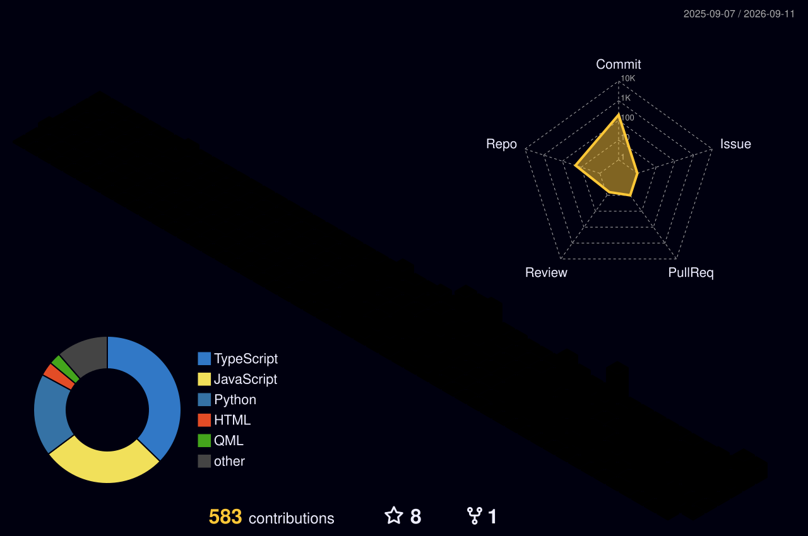

<div align="center">

# ✦ RAYHAN ✦

<a href="https://github.com/Rayhan-099">

</a>


<br>

<a href="https://github.com/Rayhan-099"></a>
<a href="https://www.linkedin.com/in/rayhan-khan-081851340/"></a>
<a href="https://x.com/rayhan_099"></a>
<a href="https://rayhank.vercel.app/"></a>
<a href="mailto:khanrayhan8307@gmail.com"></a>

<br><br>

<!-- Cute anime-style counter + a stable fallback -->


<br><br>

`✦` `building things` `✦` `breaking things` `✦` `fixing things` `✦` `making them pretty` `✦`

</div>

---

<div align="center">

> *"Somewhere between writing code, reading fiction, and wondering why this tiny project became a three-day debugging session."*

`٭･ﾟ ✦ ｡ﾟ✦｡ ﾟ ✦ ﾟ｡ ✦ ٭`

</div>

## ╭─ ✦ `whoami` ─────────────────────────╮

```text
$ whoami

Rayhan Khan

$ cat /etc/rayhan.conf

role        = "Comp Science Student + Developer"
pronouns    = "he/him"
personality = "INFP"

interests   = [
    software engineering,
    artificial intelligence,
    machine learning,
    linux,
    anime,
    games,
    books,
    music,
    cooking,
    japanese
]

current_quest = "become genuinely good at building things"
```

I'm a developer who likes taking random ideas and turning them into actual projects —
preferably while making them unnecessarily pretty.

I enjoy the intersection of **software engineering, AI/ML, creative technology, and good UI**,
but outside the terminal I'm usually somewhere between a novel, an anime episode,
a Genshin quest, or a completely unnecessary Linux customization rabbit hole.

<br>

<div align="center">

`⌨️ coding`　`🌙 questionable hours`　`🎮 Genshin`　`📚 fiction`　`🐧 Linux`

</div>

---

# ✦ CHARACTER PROFILE

<table align="center">
<tr>
<td width="50%">

### 🌌 Developer Card

```text
╭─────────────────────────────╮
│       RAYHAN KHAN           │
├─────────────────────────────┤
│ CLASS      Developer        │
│ ELEMENT    Cryo ❄️          │
│ WEAPON     Keyboard ⌨️      │
│ REGION     Snezhnaya        │
│ QUEST      Build cool stuff │
│ STATUS     Currently coding │
╰─────────────────────────────╯
```

</td>
<td width="50%">

### ✦ Current Status

```text
┌──────────────────────────────┐
│ SYSTEM STATUS                │
├──────────────────────────────┤
│ 🟢 Building AI projects     │
│ 🟢 DSA arc                  │
│ 🟢 Ricing Linux             │
│ 🟢 Experimenting with AI    │
│ 🟡 Fighting skill issues    │
│ 🔴 Grass not touched        │
└──────────────────────────────┘
```

</td>
</tr>
</table>

---

<div align="center">


</div>

# ‧₊˚ ⋅ `currently` ⋅˚₊‧

<table>
<tr>
<td width="50%" valign="top">

### ◇ building

```text
> AI-powered projects
> full-stack experiments
> making things unnecessarily pretty
```

### ◇ studying

```text
> Data Structures & Algorithms
> Artificial Intelligence / ML
> Full-stack development
> Software engineering fundamentals
```

</td>
<td width="50%" valign="top">

### ◇ experimenting with

```text
> Generative AI
> Agentic AI
> Computer Vision
> Next.js / FastAPI
> DevOps / Linux / automation
> ideas that should've stayed
  in my notes app
```

### ◇ main quest

```text
strong fundamentals
      ↓
better projects
      ↓
strong internships
      ↓
become genuinely good
at building things
```

</td>
</tr>
</table>

---

# ‧₊˚ ⋅ `~/projects` ⋅˚₊‧

> Things I've built instead of doing something sensible.

### ✦ 🌙 Lumine — AI-Powered Skin Intelligence

> Full-stack AI platform for visual skin-condition classification, personalized insights, history, trends, and an AI assistant.

**Stack:** `React` `FastAPI` `PostgreSQL` `DINOv2` `Hugging Face` `Gemini`

- 🧠 Classifies **31 visual skin conditions** using DINOv2
- 🗄️ PostgreSQL backend with JWT authentication
- 📈 History and trend tracking
- 🤖 Google Gemini + Hugging Face integrations
- 🔐 Secure image validation and API rate limiting
- 🧪 40+ automated Pytest tests
- ☁️ Deployed on Vercel + Render

<a href="https://lumineai.vercel.app/"></a>
<a href="https://github.com/Rayhan-099/lumine"></a>

---

### ✦ 💜 Current Capital — Finance Manager

> A personal finance app that budgets in envelopes and reads receipts for you.

**Stack:** `React` `Node.js` `Express` `Tailwind CSS` `Gemini AI`

- 💸 Automated expense tracking
- 📦 Dynamic envelope budgeting
- 📊 Real-time analytics with custom Recharts visualizations
- 🔐 Stateless JWT authentication
- 🧾 Gemini Vision receipt extraction + categorization
- 🎨 Glassmorphism-inspired UI
- ⚡ Low-latency REST API

<a href="https://finance-manager-zeta.vercel.app/"></a>
<a href="https://github.com/Rayhan-099/finance-manager"></a>

---

### ✦ 🌸 Health Assistant Platform

> Team-built health platform that cleared the **SIH 2025 internal round**.

**Stack:** `React` `Supabase` `Medical APIs`

- 🩺 Full-stack health platform
- ⚡ Fault-tolerant Supabase backend
- 🔌 Medical API integrations
- 🧩 5+ React modules
- ⏰ Real-time medical reminder system
- 📈 >95% reminder reliability
- ⚡ <250ms response times

<div align="center">

`idea` → `prototype` → `why is this broken` → `debug` → `make it pretty` → `ship`

</div>

---

# ‧₊˚ ⋅ `tech stack` ⋅˚₊‧

<div align="center">

### 💻 languages


### 🧠 AI / data science


### 🌐 web & backend


### 🗄️ data & cloud


### 🛠️ tools & environment


<br>

<sub><i>"I use Arch btw" 🗣️</i></sub>

</div>

<details>
<summary>✦ core competencies</summary>

<br>

`Machine Learning` `Generative AI` `Agentic AI` `Data Structures & Algorithms`
`REST APIs` `OOP`

</details>

---

# ✦ `skill tree`

```text
                         ┌───────────────────────┐
                         │     SOFTWARE DEV      │
                         └───────────┬───────────┘
                                     │
              ┌──────────────────────┼──────────────────────┐
              │                      │                      │
              ▼                      ▼                      ▼
         ┌──────────┐           ┌──────────┐           ┌──────────┐
         │ FRONTEND │           │ BACKEND  │           │  AI / ML │
         ├──────────┤           ├──────────┤           ├──────────┤
         │ React    │           │ FastAPI  │           │ PyTorch  │
         │ Next.js  │           │ Node.js  │           │ TensorFl │
         │ TypeScript│          │ Express  │           │ OpenCV   │
         │ Tailwind │           │ Django   │           │ sklearn  │
         └────┬─────┘           └────┬─────┘           └────┬─────┘
              │                      │                      │
              └──────────────────────┼──────────────────────┘
                                     │
                                     ▼
                            ┌──────────────────┐
                            │    DATA LAYER    │
                            ├──────────────────┤
                            │ PostgreSQL       │
                            │ MongoDB          │
                            │ Firebase         │
                            └──────────────────┘
```

---

# ✦ `github observatory`

<div align="center">

<a href="https://github.com/Rayhan-099">

</a>

<a href="https://github.com/Rayhan-099">

</a>

<br><br>


<br><br>


</div>

<details>
<summary>✦ trophy case</summary>

<br>

<div align="center">


</div>

</details>

---

# ✦ `contribution garden`

<div align="center">

### 🌙 every commit is another little star

<br>

<picture>
  <source media="(prefers-color-scheme: dark)" srcset="https://raw.githubusercontent.com/Rayhan-099/Rayhan-099/output/github-contribution-grid-snake-dark.svg" />
  <source media="(prefers-color-scheme: light)" srcset="https://raw.githubusercontent.com/Rayhan-099/Rayhan-099/output/github-contribution-grid-snake.svg" />
  
</picture>

<br><br>



<!-- Snake generated by Platane/snk · 3D graph by yoshi389111/github-profile-3d-contrib -->

</div>

---

# ✦ `learning arc`

```text
╭──────────────────────────────────────────────────╮
│                 CURRENTLY LEARNING               │
├──────────────────────────────────────────────────┤
│                                                  │
│  ◇ Data Structures & Algorithms                  │
│  ◇ Artificial Intelligence                       │
│  ◇ Machine Learning                              │
│  ◇ Full-stack Development                        │
│  ◇ Software Engineering Fundamentals             │
│                                                  │
│  status: ███████████░░░░░░░░░░░░░               │
│                                                  │
│  progress bar is decorative.                    │
│  unfortunately, knowledge isn't DLC.            │
│                                                  │
╰──────────────────────────────────────────────────╯
```

### 🎯 short-term

- Get better at DSA
- Strengthen programming fundamentals
- Build more serious projects
- Contribute to open source
- Land good internships

### 🌌 long-term

- Become a highly capable software / AI engineer
- Work on meaningful technology
- Build things of my own
- Keep learning and building
- Create a life that leaves room for exploration

---

# ✦ `daily quest`

```text
╭──────────────────────────────────────────╮
│              DAILY QUESTS                │
├──────────────────────────────────────────┤
│                                          │
│  [ ] learn something                     │
│  [ ] write some code                     │
│  [ ] solve something                     │
│  [ ] read something                      │
│  [ ] build something                     │
│  [ ] question an architecture decision  │
│  [ ] accidentally spend 3 hours tweaking │
│      something nobody asked for          │
│                                          │
╰──────────────────────────────────────────╯
```

---

<div align="center">


</div>

# ✦ `genshin archive`

<div align="center">


## ❄️ Skirk Main

`Asia Server` · `AR 60` · `Cryo`

**Skirk · Arlecchino · Tsaritsa**

`Snezhnaya` ❄️ · `Cryo` · `mysterious` · `elegant` · `powerful`

</div>

```text
╭────────────────────────────────────────╮
│            ADVENTURER LOG              │
├────────────────────────────────────────┤
│                                        │
│  SERVER       Asia                     │
│  AR           60                       │
│  MAIN         Skirk                    │
│  ELEMENT      Cryo                     │
│  REGION       Snezhnaya                │
│                                        │
│  Favorite characters:                  │
│  Skirk / Arlecchino / Tsaritsa         │
│                                        │
╰────────────────────────────────────────╯
```

> Somewhere between writing production code and farming fictional characters
> who absolutely do not need another artifact.

---

# ✦ `anime / manga archive`

| ✦ | Current lore |
|:---:|:---|
| 🍖 | **One Piece** — favorite anime |
| 📖 | **Monogatari** — favorite light novel |
| ⚔️ | Bleach |
| 🌸 | Kaoruhana |
| 🍥 | Evangelion |

`novels` · `light novels` · `manga` · `lore` · `character design` · `fictional worlds`

---

# ✦ `game library`

<div align="center">

| 🎮 game | status |
|:---|:---:|
| ❄️ Genshin Impact | `AR 60 • Skirk Main` |
| ⛏️ Minecraft | `building something unnecessary` |
| 🗡️ Hollow Knight | `respectfully suffering` |
| 🐛 Silksong | `yes.` |

</div>

---

# ✦ `music after midnight`

<div align="center">

### 🎧 Cigarettes After Sex

`dream pop` · `indie` · `alternative` · `ambient`  
`bedroom pop` · `lo-fi` · `melancholic` · `atmospheric`

<br>

<a href="https://open.spotify.com/user/31zb5zzelmr3ql6z3v2o44okp2ju">

</a>

</div>

> *"whatever song happens to emotionally destroy me at 2 AM."*

---

# ✦ `outside the terminal`

<table align="center">
<tr>
<td align="center" width="25%">

### 📚

**READING**

novels  
light novels  
manga

</td>
<td align="center" width="25%">

### 🎮

**GAMING**

Genshin  
Minecraft  
Hollow Knight

</td>
<td align="center" width="25%">

### 🍳

**CREATING**

coding  
cooking  
writing poems

</td>
<td align="center" width="25%">

### 🌸

**EXPLORING**

Japanese  
Linux  
literature

</td>
</tr>
</table>

---

# ✦ `things i could talk about for hours`

```text
AI
├── machine learning
├── generative AI
├── computer vision
└── "wait... what if we made this?"

TECH
├── programming
├── Linux
├── software architecture
└── weird debugging problems

FICTION
├── anime
├── manga
├── novels
├── Genshin lore
└── fictional characters

RANDOM
├── psychology
├── mythology
├── Japanese culture
├── aesthetics
└── philosophical questions at inconvenient hours
```

---

# ✦ `inventory`

```text
╭────────────────────────────────────────────╮
│                INVENTORY                   │
├────────────────────────────────────────────┤
│                                            │
│  ⌨️  Keyboard                  [ EQUIPPED ]│
│  💻  Laptop                    [ EQUIPPED ]│
│  🐧  Arch Linux                [ EQUIPPED ]│
│  📚  Random novel              [ +10 LORE ]│
│  🎮  Genshin                   [ DANGER ]  │
│  ☕  Coffee                    [ MISSING ] │
│                                            │
╰────────────────────────────────────────────╯
```

---

# ✦ `achievement unlocked`

```text
╭─────────────────────────────────────────╮
│        ✦ ACHIEVEMENT UNLOCKED ✦        │
├─────────────────────────────────────────┤
│                                         │
│  「IT LOOKED EASIER IN MY HEAD」         │
│                                         │
│  Started a small project.               │
│  Added one feature.                     │
│  Added another feature.                 │
│  Accidentally created an entire system. │
│                                         │
│                    +100 EXP             │
╰─────────────────────────────────────────╯
```

---

# ✦ `system.log`

```console
$ whoami
Rayhan Khan

$ echo $ROLE
B.Tech CSE / Developer

$ echo $OS
Arch Linux btw

$ echo $CURRENT_FOCUS
DSA + AI/ML + full-stack

$ echo $CURRENT_PROJECT
AI-powered things

$ echo $STATUS
building...

$ echo $GRASS
command not found
```

---

# ✦ `goals`

### `01 — become dangerous with fundamentals`

Get genuinely comfortable with programming, DSA, software engineering,
and the foundations behind the tools I use.

### `02 — build things worth showing`

Not just tutorial projects.

Things with actual ideas behind them.

### `03 — get real-world experience`

Land strong internships and learn what engineering looks like
outside a classroom.

### `04 — explore AI seriously`

Keep experimenting with machine learning, generative AI,
computer vision, and whatever comes next.

### `05 — keep creating`

Read more. Write more. Learn Japanese.
Build random things because they're fun.

---

# ✦ `let's talk`

<div align="center">

<a href="https://github.com/Rayhan-099"></a>
<a href="https://www.linkedin.com/in/rayhan-khan-081851340/"></a>
<a href="https://x.com/rayhan_099"></a>
<a href="https://rayhank.vercel.app/"></a>
<a href="https://open.spotify.com/user/31zb5zzelmr3ql6z3v2o44okp2ju"></a>

<br>

`thanks for stopping by ♡`

<br>

`code something.`  
`read something.`  
`learn something.`  
`make something unnecessarily pretty.`

<br>

### `see you somewhere between the terminal and teyvat.` 


`✦ ───────────────────────────────────────── ✦`

<sub>Rayhan Khan · B.Tech CSE · developer · reader · gamer · builder</sub>

</div>


